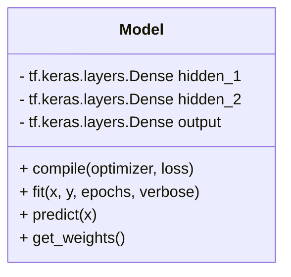
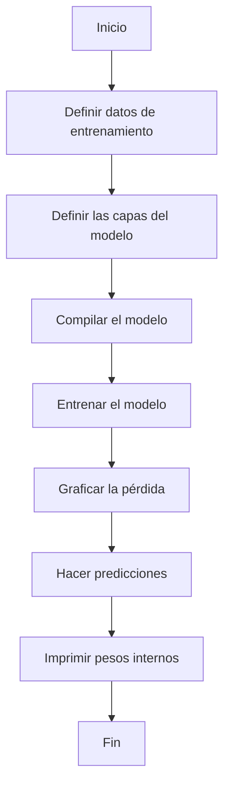

# Documentación del Código: Conversión de Celsius a Fahrenheit con TensorFlow

## Descripción General

Este proyecto utiliza una red neuronal simple para modelar la relación entre temperaturas en grados Celsius y Fahrenheit. Utiliza TensorFlow para crear y entrenar el modelo, y Matplotlib para visualizar la pérdida durante el entrenamiento.

## Requisitos

- TensorFlow
- NumPy
- Matplotlib

Puedes instalar estas dependencias usando el siguiente comando:

```bash
pip install tensorflow numpy matplotlib
```

## Estructura del Código

1. **Importación de Librerías:**
   ```python
   import tensorflow as tf
   import numpy as np
   import matplotlib.pyplot as plt
   ```
   - `tensorflow`: Usado para crear y entrenar el modelo de red neuronal.
   - `numpy`: Usado para manejar los arrays de datos.
   - `matplotlib.pyplot`: Usado para graficar la pérdida durante el entrenamiento.

2. **Datos de Entrenamiento:**
   ```python
   celsius = np.array([-40, -10, 0, 8, 15, 22, 38], dtype=float)
   fahrenheit = np.array([-40, 14, 32, 46, 59, 72, 100], dtype=float)
   ```
   - `celsius`: Array que contiene valores de temperatura en grados Celsius.
   - `fahrenheit`: Array que contiene los valores correspondientes en grados Fahrenheit.

3. **Definición del Modelo:**
   ```python
   hidden_1 = tf.keras.layers.Dense(units=3, input_shape=[1])
   hidden_2 = tf.keras.layers.Dense(units=3)
   output = tf.keras.layers.Dense(units=1)

   model = tf.keras.Sequential([hidden_1, hidden_2, output])
   ```
   - `hidden_1` y `hidden_2`: Capas ocultas con 3 neuronas cada una.
   - `output`: Capa de salida con una neurona.
   - `model`: Modelo secuencial que combina todas las capas.

4. **Compilación del Modelo:**
   ```python
   model.compile(
       optimizer=tf.keras.optimizers.Adam(0.1),
       loss='mean_squared_error'
   )
   ```
   - Se utiliza el optimizador `Adam` con una tasa de aprendizaje de 0.1.
   - La función de pérdida es el error cuadrático medio (`mean_squared_error`).

5. **Entrenamiento del Modelo:**
   ```python
   history = model.fit(celsius, fahrenheit, epochs=1000, verbose=False)
   ```
   - Entrena el modelo durante 1000 épocas.

6. **Visualización de la Pérdida:**
   ```python
   plt.xlabel("# Time")
   plt.ylabel("Magnitude of loss")
   plt.plot(history.history["loss"])
   plt.show()
   ```
   - Grafica la pérdida a lo largo del tiempo (número de épocas).

7. **Predicción:**
   ```python
   result = model.predict(np.array([100.0]))
   print(f"The result is {result[0][0]:.2f} fahrenheit!")
   ```
   - Realiza una predicción para una temperatura de 100 grados Celsius.

8. **Variables Internas del Modelo:**
   ```python
   print("Internal variables of the model")
   print("Hidden layer 1 weights:", hidden_1.get_weights())
   print("Hidden layer 2 weights:", hidden_2.get_weights())
   print("Output layer weights:", output.get_weights())
   ```
   - Imprime los pesos internos de las capas del modelo.

## Diagrama de Clases



## Diagrama de Flujo


